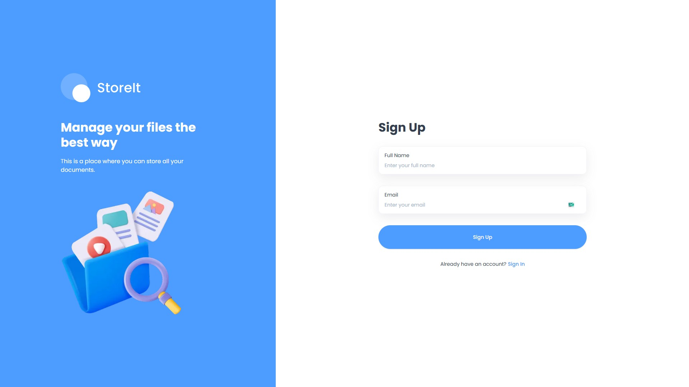
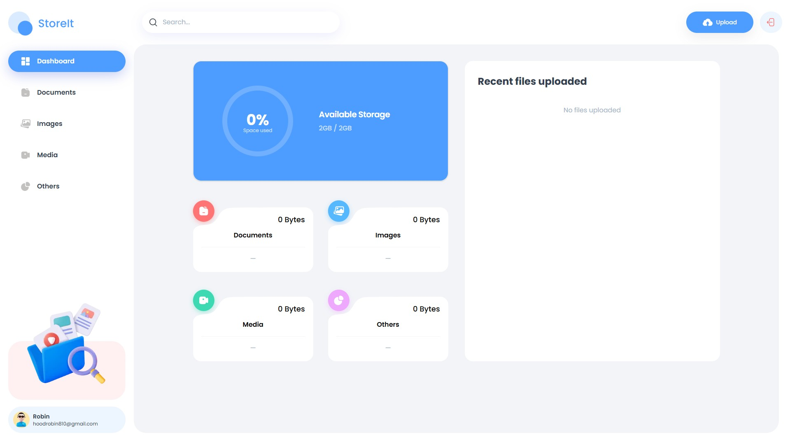

# StoreIt - File Storage Management Application

StoreIt is a modern, full-stack file storage application built with Next.js and Appwrite. It enables users to securely store, organize, share, and manage their files across different categories with a sleek, responsive UI.




## Features

- **User Authentication**: Secure sign-up and sign-in functionality with email OTP verification
- **File Management**: Upload, download, rename, and delete files
- **File Categorization**: Automatic categorization of files (Documents, Images, Media, Others)
- **File Sharing**: Share files with other users by email
- **Storage Analytics**: Visual representation of storage usage with interactive charts
- **Responsive Design**: Optimized for both desktop and mobile devices
- **Real-time Updates**: Instant UI updates when files are uploaded, modified, or deleted
- **Search Functionality**: Search across all your files with debounced queries
- **Sort Options**: Sort files by name, date, or size in ascending or descending order

## Tech Stack

### Frontend
- **Next.js 15**: React framework with App Router for server-side rendering and routing
- **TypeScript**: Type-safe code development
- **Tailwind CSS**: Utility-first CSS framework for styling
- **Shadcn UI**: Reusable UI components built with Radix UI
- **Recharts**: Composable charting library for data visualization
- **React Hook Form**: Form validation and handling with Zod
- **React Dropzone**: File upload functionality

### Backend
- **Appwrite**: Backend-as-a-Service for authentication, database, and storage
- **Next.js Server Actions**: Serverless functions for backend logic

## Project Structure

```
├── app/                  # Next.js app router
│   ├── (auth)/           # Authentication routes (sign-in, sign-up)
│   ├── (root)/           # Main application routes
│   │   ├── [type]/       # Dynamic routes for file types
│   │   └── page.tsx      # Dashboard page
│   └── globals.css       # Global styles
├── components/           # React components
│   ├── ui/               # Reusable UI components
│   └── ...               # App-specific components
├── constants/            # Application constants
├── hooks/                # Custom React hooks
├── lib/                  # Utility functions and API handlers
│   ├── actions/          # Server actions (file and user operations)
│   ├── appwrite/         # Appwrite configuration and client setup
│   └── utils.ts          # Helper functions
├── public/               # Static assets
│   └── assets/           # Icons and images
└── types/                # TypeScript type definitions
```

## Core Components

- **Dashboard**: Shows storage usage summary and recent files
- **ActionDropdown**: Context menu for file operations (rename, share, download, delete)
- **FileUploader**: Handles file uploads with drag-and-drop functionality
- **Chart**: Visual representation of storage usage
- **Search**: Real-time file search with debounced queries
- **OptimizedNavigation**: Performance-optimized navigation with preloading
- **Thumbnail**: Dynamic file thumbnails based on file type
- **MobileNavigation**: Responsive mobile menu

## Getting Started

### Prerequisites

- Node.js 18+ 
- npm or yarn
- Appwrite account and project setup

### Installation

1. Clone the repository:

```bash
git clone https://github.com/Tanjim-Islam/Storage-management.git
cd Storage-management
```

2. Install dependencies:

```bash
npm install
# or
yarn install
```

3. Create a `.env.local` file in the root directory with the following environment variables:

```
NEXT_PUBLIC_APPWRITE_ENDPOINT=https://cloud.appwrite.io/v1
NEXT_PUBLIC_APPWRITE_PROJECT=your-project-id
NEXT_PUBLIC_APPWRITE_DATABASE=your-database-id
NEXT_PUBLIC_APPWRITE_USERS_COLLECTION=your-users-collection-id
NEXT_PUBLIC_APPWRITE_FILES_COLLECTION=your-files-collection-id
NEXT_PUBLIC_APPWRITE_BUCKET=your-bucket-id
NEXT_APPWRITE_KEY=your-appwrite-api-key
```

4. Run the development server:

```bash
npm run dev
# or
yarn dev
```

5. Open [http://localhost:3000](http://localhost:3000) in your browser.

## Appwrite Setup

1. Create an Appwrite project from the Appwrite console
2. Set up a database with two collections:
   - Users collection
   - Files collection
3. Create a storage bucket for file uploads
4. Set up API keys and permissions
5. Update the environment variables with your Appwrite project details

## Key Features Implementation

### File Upload

The application uses React Dropzone for file uploads. Files are processed, validated, and uploaded to Appwrite storage. Metadata is stored in the database for easy retrieval.

### File Categorization

Files are automatically categorized based on their extension:
- **Documents**: pdf, doc, docx, txt, etc.
- **Images**: jpg, jpeg, png, gif, etc.
- **Media**: mp4, avi, mp3, wav, etc.
- **Others**: Any other file type

### Storage Analytics

The dashboard displays a radial chart showing storage usage percentage and categorizes files by type with usage statistics.

### Responsive UI

The UI is optimized for different screen sizes:
- Desktop: Full sidebar navigation and detailed file views
- Tablet: Condensed sidebar with icons
- Mobile: Off-canvas navigation and simplified views

### Performance Optimization

- Image optimization with Next.js Image component
- Lazy loading of non-critical components
- Debounced search queries to minimize API calls
- Client-side navigation with prefetching

## License

This project is licensed under the MIT License - see the LICENSE file for details.